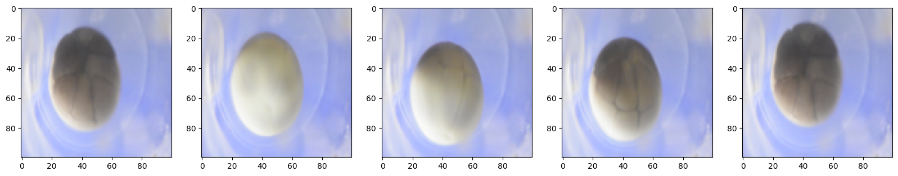
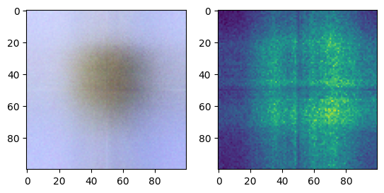
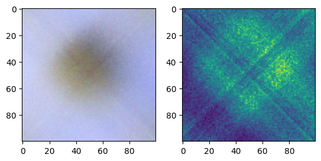

# Embryo NeRF 
Embryo NeRF is an implementation of nano NeRF that will be 3D reconstructing microscopic images of an Embryo. The following are the planned steps.
- Step one is to train a NeRF model that can 3D reconstruct synthetic sphere like structure. The synthetic dataset is prepared using a python script called generate_sphere.py
- Step two is to train the pre-trained model and fine tune it to generate the actual 3D embryos.

# Training 🛠️

# Fine Tuning 🪛

# Dataset 📁
At the moment the dataset consists of 5 microscopic embryo images. The embryo_data.json file consists fo the corresponding camera parameters for each image. Here is how the visuaized data!

# Inference 📊
The following is the inference of the model on the above dataset. The model was trained for 50 iterations and the following is the result.
Here are some example of the generated image view and it's corresponding depth map.

